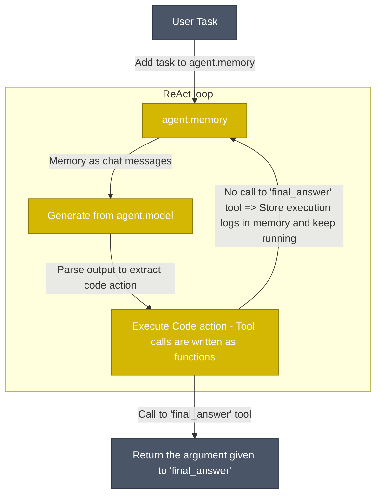

# tinyAgent‑lite — Minimal TypeScript Agent Framework

**tinyAgent‑lite** is a stripped‑down TypeScript port that captures the essence of the original Python‑based **tinyAgent** framework in roughly 150 lines of code. It showcases how decorators, metadata, and a single LLM call can create a fully‑functional AI agent that discovers and executes local tools.

---

## 1 . Project Structure

```text
src/
├── decorators.ts   # @model and @tool decorators + metadata registry
├── agent.ts        # base Agent class • LLM orchestration • tool runtime
├── index.ts        # demo CalcAgent with two math tools
├── multiplierAgent.ts # demo MultiplierAgent with one math tool
├── final-answer.tool.ts # always-run tool returning the agent's answer
└── triageAgent.ts  # simple agent listing tools for manual selection
```

---

## 2 . Quick Start

First, please make sure you have Node.js and npm installed.

```bash
# 1 . Clone the repository and install dependencies
git clone <repository-url> # Or download the code
cd tinyagent-ts
npm install

# 2 . Create a .env file in the root directory with your OpenRouter key
# .env content:
# OPENROUTER_API_KEY="sk-or-..."

# Or, alternatively, export the key to your environment:
export OPENROUTER_API_KEY="sk-or-…"

# 3 . Run the original CalcAgent demo
npx ts-node src/index.ts

# 4 . Run the MultiplierAgent demo
npx ts-node src/multiplierAgent.ts

# 5 . Try the TriageAgent
npx ts-node src/triageAgent.ts

# 6 . ReAct JSON example
npx ts-node src/examples/react.ts
```

The agent demos will ask an LLM (via OpenRouter) whether it should answer directly or call one of its local tools, then print the final reply. The `multiplierAgent.ts` specifically uses `dotenv` to load the key from the `.env` file. The `TriageAgent` simply lists your available tools and prompts you to pick one.

---

## 3 . How It Works

1. **Tool declaration**

   ```ts
   @tool('Sum two numbers', z.object({ a: z.number(), b: z.number() }))
   add({ a, b }) { return String(a + b); }
   ```

   - `@tool` stores **name, description, Zod schema, and method** in metadata.
   - Runtime validation ensures bad arguments are rejected early.

2. **Agent execution flow**

   1. Build a _system prompt_ that lists every tool.
   2. Send `[system, user]` messages to the chosen LLM (`@model`).
   3. If the LLM replies with JSON `{"tool":"name","args":{…}}`, the agent:

      - Validates `args` using the stored Zod schema.
      - Executes the bound class method.
      - Sends `TOOL_RESULT` back to the model for a polished answer.

   4. Otherwise, return the text reply directly.



3. **Extensibility**

   - **Add tools** → just decorate another method.
   - **Change model** → swap the string in `@model('provider:model')`.
   - **Replace LLM backend** → adjust the fetch endpoint & headers.

## Prompt Templates

The framework ships with a tiny `PromptEngine` offering default templates like
`greeting`. Markdown files under `src/core/prompts/system` are automatically
loaded as templates (e.g. `agent.md`, `retry.md`). Pass an object to the
constructor to override any built-in template or call `register()` to add new
ones. You can also drop a new `.md` file in that directory and call
`loadDir()` to make it available. Registering an existing key throws an error
saying `already exists — use overwrite()`. To force replacement, use
`overwrite()`. You can also point to a specific file when constructing a
`PromptEngine` to override a built-in template:

```ts
const engine = new PromptEngine({}, { agent: '/path/to/my.md' });
```

---

## 4 . Design Highlights

| Decision                        | Rationale                                                   |
| ------------------------------- | ----------------------------------------------------------- |
| Decorators + `reflect‑metadata` | Zero boilerplate for users; rich runtime metadata.          |
| Zod schemas on tools            | Strong arg validation and IDE‑friendly typings.             |
| Two‑turn tool loop              | Lets the model _act → observe → refine_ like ReAct pattern. |
| Single file per concern         | Keeps cognitive load minimal; ideal teaching skeleton.      |

---

## ReAct Implementation

TinyAgent‑TS now mirrors the strict Thought→Action→Observation loop from [the ReAct paper](https://arxiv.org/abs/2210.03629). Key pieces:

1. **Prompt & reasoning** – a single `react` prompt enforces explicit `Thought`, `Action`, and `Observation` fields.
2. **Typed objects** – `ThoughtStep`, `ActionStep`, and `ObservationStep` interfaces keep memory structured.
3. **Scratchpad / memory** – the `Scratchpad` class renders steps back into chat messages for the model.
4. **Execution loop** – `MultiStepAgent` cycles through the scratchpad until a `final_answer` action is returned.
5. **Debug & transparency** – pass `--trace` (or `trace: true`) to log each `T/A/O` triple as it happens.
6. **Docs & example** – see `src/examples/react.ts` for a minimal JSON‑tool agent using these pieces.
7. **Reflexion** – after each Observation, the agent sends `Reflect:` for a self-critique and optional fix.

---

## 5 . Next Steps

- **Streaming** responses (`streamText`) for UI‑friendly progress.
- **Retry / back‑off** wrapper for transient LLM errors.
- **Rate‑limiting & caching** per tool (mirroring the Python original).
- **Dynamic agent factory** to auto‑generate new tools at runtime.

---

## License

MIT — free to fork, hack, and grow.
