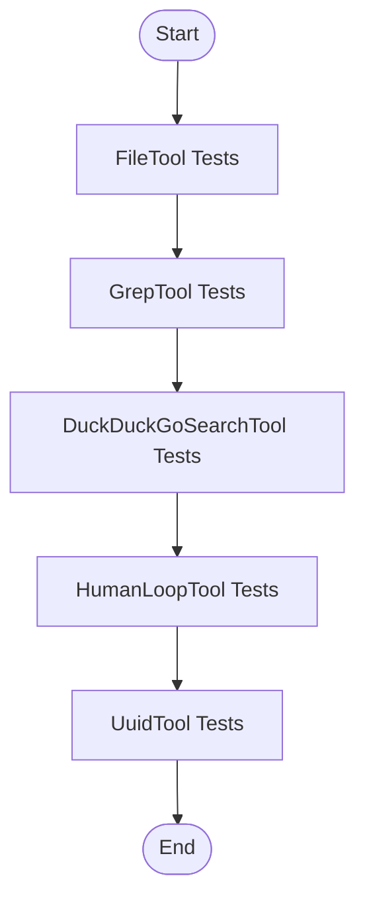

t# Plan: Default API Tool Integration Testing

**Location:** [`logistics/plans/api_tool_integration_testing.md`](logistics/plans/api_tool_integration_testing.md)

## 1. Overview

This plan describes how to thoroughly test all default API tools in the project by actually invoking each tool in realistic scenarios. The tests will be implemented in TypeScript, using Jest, and will be placed in the `test/` directory. The plan covers the following tools:

- **DuckDuckGoSearchTool** ([`src/default-tools/duckduckgo-search.tool.ts`](src/default-tools/duckduckgo-search.tool.ts))
- **FileTool** ([`src/default-tools/file.tool.ts`](src/default-tools/file.tool.ts))
- **GrepTool** ([`src/default-tools/grep.tool.ts`](src/default-tools/grep.tool.ts))
- **HumanLoopTool** ([`src/default-tools/human-loop.tool.ts`](src/default-tools/human-loop.tool.ts))
- **UuidTool** ([`src/default-tools/uuid.tool.ts`](src/default-tools/uuid.tool.ts))

## 2. File Locations

| Tool Name                | Source File Location                                 | Example File Location                |
|--------------------------|-----------------------------------------------------|--------------------------------------|
| DuckDuckGoSearchTool     | [`src/default-tools/duckduckgo-search.tool.ts`](src/default-tools/duckduckgo-search.tool.ts) | [`examples/duck-search-tool.ts`](examples/duck-search-tool.ts) |
| FileTool                 | [`src/default-tools/file.tool.ts`](src/default-tools/file.tool.ts) | [`examples/file-tool.ts`](examples/file-tool.ts) |
| GrepTool                 | [`src/default-tools/grep.tool.ts`](src/default-tools/grep.tool.ts) | [`examples/grep-tool.ts`](examples/grep-tool.ts) |
| HumanLoopTool            | [`src/default-tools/human-loop.tool.ts`](src/default-tools/human-loop.tool.ts) | [`examples/human-loop-tool.ts`](examples/human-loop-tool.ts) (if exists) |
| UuidTool                 | [`src/default-tools/uuid.tool.ts`](src/default-tools/uuid.tool.ts) | [`examples/uuid-tool.ts`](examples/uuid-tool.ts) |

## 3. Test File Location

- All integration tests for these tools will be placed in a new file: [`test/api_tool.integration.test.ts`](test/api_tool.integration.test.ts)

## 4. Test Scenarios

### 4.1 FileTool (Tested First)
- Read an existing file
- Write to a new file
- Append to an existing file
- Delete a file
- Handle errors (e.g., reading a non-existent file)

### 4.2 GrepTool
- Search for text in a file (positive match)
- Search for text in a file (no match)
- Handle invalid regex

### 4.3 DuckDuckGoSearchTool
- Search for a known term and verify results
- Handle no results
- Test safe search options
- Test retry logic on failure (simulate network error)

### 4.4 HumanLoopTool
- Prompt for input and receive a response
- Handle empty input
- Handle user cancellation (simulate Ctrl+C or EOF)
- Validate prompt customization

### 4.5 UuidTool
- Generate a UUID and verify its format
- Ensure uniqueness across multiple generations

## 5. Test Case Structure

- Use Jest for test organization and assertions
- Use actual tool implementations (no mocks for core logic)
- Use temporary files for file-based tests (clean up after tests)
- For network tools, use real API calls where feasible, but allow for fallback to mocks if rate-limited
- For HumanLoopTool, simulate user input where possible
- Validate both success and error scenarios

## 6. Test Execution

- Run tests with: `npm test`
- Ensure all tests pass and cover edge cases
- Confirm TypeScript compatibility

## 7. Workflow Diagram

## 8. Implementation Steps

1. **Create Test File:**  
   - Create [`test/api_tool.integration.test.ts`](test/api_tool.integration.test.ts)

2. **Import Tools:**  
   - Import each tool from `src/default-tools/`

3. **Write FileTool Tests:**  
   - Implement and run all FileTool scenarios

4. **Write GrepTool Tests:**  
   - Implement and run all GrepTool scenarios

5. **Write DuckDuckGoSearchTool Tests:**  
   - Implement and run all DuckDuckGoSearchTool scenarios

6. **Write HumanLoopTool Tests:**  
   - Implement and run all HumanLoopTool scenarios

7. **Write UuidTool Tests:**  
   - Implement and run all UuidTool scenarios

8. **Run and Validate:**  
   - Execute `npm test` and ensure all tests pass

9. **Document Results:**  
   - Summarize findings and update documentation as needed