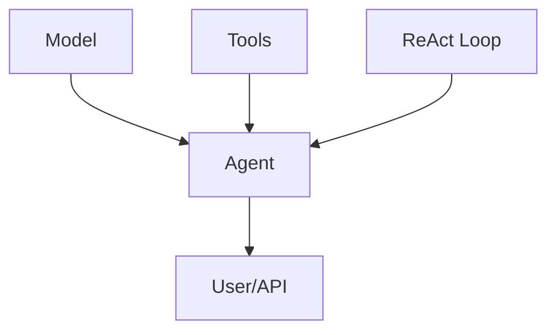

# Ergonomic Agent Framework Migration Plan

## Objective

Unify the agent architecture to follow a modular, ergonomic structure:

- **model/**
- **agent/**
- **tools/**
- **react/**

This will simplify development, improve maintainability, and enable advanced reasoning by default.

---

## 1. Audit Current Codebase

- **Agent Logic:** [`src/agent.ts`](src/agent.ts:1), [`src/multiStepAgent.ts`](src/multiStepAgent.ts:1), [`src/triageAgent.ts`](src/triageAgent.ts:1)
- **Tools:** [`src/default-tools/`](src/default-tools/)
- **ReAct Logic:** [`src/multiStepAgent.ts`](src/multiStepAgent.ts:1), [`src/core/prompts/system/react.md`](src/core/prompts/system/react.md:1)
- **Model/LLM:** [`src/promptEngine.ts`](src/promptEngine.ts:1), [`src/agent.ts`](src/agent.ts:1)
- **CLI:** [`src/cli-*.ts`](src/cli-formatter.ts:1), [`src/cli/index.ts`](src/cli/index.ts:1), [`src/cli-refactored.ts`](src/cli-refactored.ts:1)
- **Decorators/Extensibility:** [`src/decorators.ts`](src/decorators.ts:1)

---

## 2. Design Target Architecture

**Directory Structure:**
```
src/
  model/
  agent/
  tools/
  react/
  cli/
```

**Layer Responsibilities:**

| Layer   | Responsibility                                 |
|---------|------------------------------------------------|
| model   | LLM/backend communication                      |
| agent   | Orchestration, state, workflow                 |
| tools   | Modular, pluggable capabilities                |
| react   | Reasoning and acting loop (ReAct pattern)      |

**Mermaid Diagram:**


---

## 3. Migration Steps

### Phase 1: Preparation
- Review all agent instantiations and usages.
- Identify all tool integrations and ReAct logic.
- Document configuration and extension points.

### Phase 2: Modularization
- Move LLM/model logic to `model/`.
- Move all agent orchestration logic to `agent/`.
- Refactor tools into `tools/` with a standard interface.
- Extract ReAct loop and prompts into `react/`.

### Phase 3: Unification
- Refactor to a single, configurable agent class using ReAct by default.
- Ensure agent can be configured for simple or multi-step workflows.

### Phase 4: CLI Refactor
- Update CLI to instantiate and configure the new agent.
- Adjust tool registration and workflow selection.
- Update CLI help and documentation.

### Phase 5: Testing & Validation
- Run all existing tests; add new tests for unified agent.
- Perform regression testing on CLI and API surfaces.

### Phase 6: Documentation & Communication
- Update all documentation to reflect new structure.
- Communicate migration plan and changes to the team.

---

## 4. Risks & Mitigations

- **Risk:** Breaking changes to CLI or API.
  - *Mitigation:* Incremental refactoring, feature flags, thorough testing.
- **Risk:** Missed edge cases in agent logic.
  - *Mitigation:* Comprehensive test coverage, phased rollout.


---

## 6. Success Criteria

- All agent logic unified under a single, ergonomic architecture.
- CLI and API function as before or better.
- Codebase is easier to maintain and extend.

---

This plan provides a clear, actionable path to a modern, ergonomic agent framework.